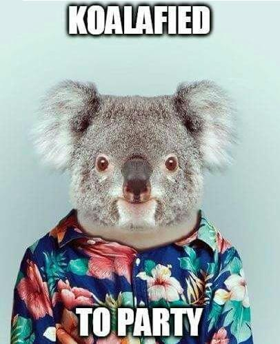

class: center, middle

# Wendigo
### And Other Monsters
_@angrykoala_

---


## The Me

* Andrés Ortiz

* https://github.com/angrykoala

Software developer, koala fan and OS contributor.

---
class: center, middle




---

## What is Browser Automation?

```js
browser.open("www.google.com");

browser.click(".button");

browser.type("Hello there");
```

---
## Why

* **Web Scraping**

* **Services Automation**

* **Testing**

---

## Challenges

* **Performance.**

* **Unreliability (race conditions, bugs, complexity, ...).**

* **APIs out of our control.**

---

## How To

1. **Create a Headless Browser.**

2. **Use Webdriver.** (https://www.w3.org/TR/webdriver1)

3. **Use Browser-specific tools.**

---

## Monstrous Tools

* **Selenium** - https://www.seleniumhq.org

* **Puppeteer** - https://github.com/GoogleChrome/puppeteer

* **Cypress.io** - https://www.cypress.io

--
count: false

* **Wendigo** - https://github.com/angrykoala/wendigo  


---
class: center, middle

## Examples

---
class: center, middle

## Workshop
