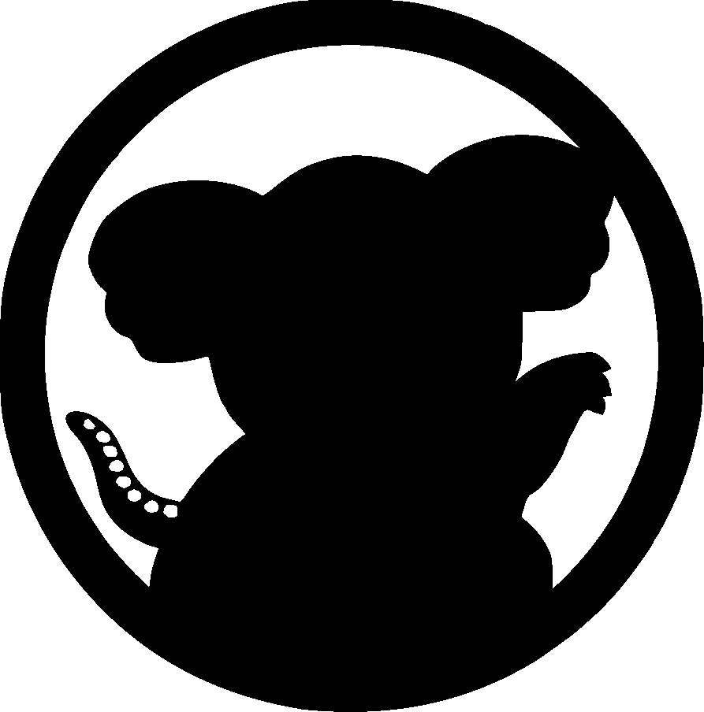
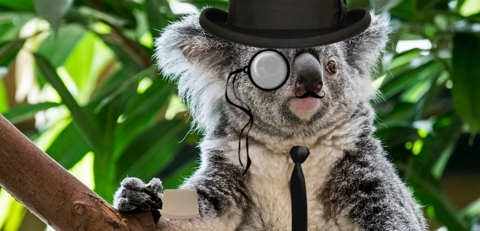
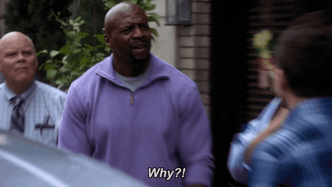

class: center, middle

# Browsers, Automation
### and Koalas

#### An ~~easy~~ introduction to Browser Automation

_by @angrykoala_


---


## The Me

* Andrés Ortiz

* https://github.com/angrykoala

Software developer, koala fan,OS contributor.




---
class: center, middle


---

## What is Browser Automation?

```js
browser.open("www.google.com");

browser.click(".button");

browser.type("Hello there");
```

--
count:false

<center>
    
</center>

---
## Why?

<center>
    
</center>
---
## Why?

* **Web Scraping**

* **Services Automation**

* **Testing!!**

---

## Challenges

* **Performance.**

* **Unreliability.**

* **APIs out of our control.**

* **Race Conditions.**

--
count:false

<center>
    
</center>

---

## Koalafied Tools

* **Selenium** - https://www.seleniumhq.org

* **Puppeteer** - https://github.com/GoogleChrome/puppeteer

* **Cypress.io** - https://www.cypress.io

--
count: false

* **Wendigo** - https://github.com/angrykoala/wendigo  


---
class: center

## Examples


